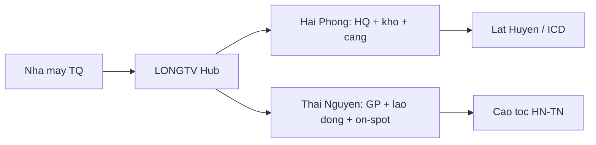

# Tổ hợp dịch vụ All-in-one — LONGTV

> **Ý tưởng chiến lược:** Xây dựng **một tổ hợp dịch vụ** (Tư vấn – Pháp lý – Logistics) phục vụ riêng làn sóng **FDI Trung Quốc** tại **Hải Phòng** và **Thái Nguyên** — thay vì để NĐT phải làm việc với 3 bên rời rạc.
>
> **Cam kết định vị (mục tiêu):** Rút ngắn **time-to-market** từ ~**6 tháng** (tự làm / nhiều vendor) xuống ~**3 tháng** (một đầu mối LONGTV + đối tác có giấy phép).

---

## 1. Vì sao 2 tỉnh này?

| Tỉnh | Vai trò trong chuỗi cung ứng | Ngành trọng tâm FDI TQ |
|------|------------------------------|-------------------------|
| **Hải Phòng** | Thủ phủ cảng biển Bắc Bộ · logistics · công nghiệp nặng | Linh kiện ô tô, cơ khí, logistics XNK |
| **Thái Nguyên** | Trung tâm công nghệ cao · vệ tinh Samsung | Điện tử, linh kiện, công nghiệp phụ trợ |

LONGTV **không** cạnh tranh mega-project (Samsung supply chain tier-1) ngay từ đầu — tập trung **Tier 2–3 NM TQ** (50–300 lao động) từ Thâm Quyến, Quảng Đông, Chiết Giang… ([persona-v1](/docs/03-departments/03-kinh-doanh/persona-v1)).

---

## 2. Mô hình All-in-one vs 3 vendor

```
TRUYỀN THỐNG (6+ tháng)                    LONGTV ALL-IN-ONE (mục tiêu 3 tháng)
┌─────────┐ ┌─────────┐ ┌─────────┐          ┌──────────────────────────────┐
│ Công ty │ │ Đại lý  │ │ Forwarder│          │         LONGTV Hub          │
│  luật   │ │ hải quan│ │ / kho   │          │  PM một cửa · song ngữ TQ   │
└────┬────┘ └────┬────┘ └────┬────┘          └───────┬──────────┬───────────┘
     │           │           │                      │          │
     └───────────┴───────────┘                      ▼          ▼
           Khách TQ tự phối hợp              Đối tác luật   Đối tác logistics
                                             (có GPLS)      (có GP WTO)
```

| Tiêu chí | 3 bên rời | All-in-one LONGTV |
|----------|-----------|-------------------|
| Đầu mối | 3+ contact | **1 PM** |
| Ngôn ngữ | Lệch chuẩn | **Việt–Trung thương mại** |
| Timeline IRC→vận hành | 5–8 tháng | **Mục tiêu 3–4 tháng** (bundle) |
| Trách nhiệm khi trễ | Đổ lỗi chéo | **Một HĐ** + SLA milestone |
| Chi phí nhận thức | Rải rác | Gói **Full Setup** $14–18k + retainer |

*Timeline 3 tháng là **mục tiêu** với điều kiện: hồ sơ TQ đầy đủ, ngành không thuộc loại hình đặc biệt (hóa chất, DTM nặng), đất thuê qua KCN có sẵn quỹ.*

---

## 3. Ba trụ cột dịch vụ

### 3.1. Tư vấn & chính sách (LONGTV trực tiếp)

| Dịch vụ | Mã | Giai đoạn |
|---------|-----|-----------|
| Khảo sát 2 tỉnh / chọn điểm | A1, A2 | G0–G2 |
| Làm việc Sở KH&ĐT, Ban QLKCN | A1+ | G1–G3 |
| So sánh ưu đãi CIT KKT Đình Vũ–Cát Hải vs KCN TN | A1 | G1 |
| Retainer tư vấn chính sách | C1 | G4–G5 |

### 3.2. Pháp lý (white-label đối tác có GPLS)

| Thủ tục | LONGTV vai trò | Đối tác |
|---------|----------------|---------|
| IRC, ERC | Điều phối, checklist | **Công ty luật** |
| Giấy phép môi trường, PCCC | PM hồ sơ | Luật + tư vấn môi trường |
| HĐ lao động, NDA song ngữ | Template + review | Luật sư ký |

→ Chi tiết: [all-in-one-licensed-entities](/docs/03-departments/02-phap-ly/all-in-one-licensed-entities)

### 3.3. Logistics (đối tác / Oz tools — giai đoạn 1)

| Dịch vụ | HP trọng tâm | TN trọng tâm |
|---------|--------------|--------------|
| Hải quan, HS code | ✅ **Core** | On-spot XNK |
| Kho / ICD gần Lạch Huyện | ✅ Mục tiêu Y2 | Consolidation warehouse |
| Vận chuyển nội địa | Cảng → KCN | Cao tốc HN–TN |
| Demurrage / detention tối ưu | ✅ | — |

**Giai đoạn bootstrap:** LONGTV **không** tự sở hữu kho/đội xe — **MOU** forwarder + đại lý HQ có giấy phép. Scale Y2–Y3 mới xem xét CAPEX kho/ICD.

---

## 4. Khảo sát thực địa: Hải Phòng vs Thái Nguyên

| Tiêu chí | **Hải Phòng** | **Thái Nguyên** |
|----------|---------------|-----------------|
| **Lợi thế địa lý** | Cảng biển lớn nhất Bắc Bộ; đường biển tới cảng Nam Trung Quốc | Sát biên Lạng Sơn; hành lang Nanning–Hà Nội–Hải Phòng |
| **Dịch vụ trọng tâm** | Customs brokerage, warehousing, tối ưu lưu kho (demurrage/detention) | Tuyển dụng LĐ/kỹ sư, on-spot XNK cho chuỗi phụ trợ |
| **KCN / KKT then chốt** | Nam Đình Vũ, Đình Vũ–Cát Hải (KKT), Deep C | Yên Bình, Sông Công, KCN Samsung ecosystem |
| **Ưu đãi CIT** | KKT Đình Vũ–Cát Hải — cần field verify 🟡 | KCN TN — ưu đãi theo ngành 🟡 |
| **Rào cản pháp lý** | Điều kiện DN logistics FDI (WTO, vốn tối thiểu) | Quy hoạch đất, **DTM** nước thải (kiểm soát chặt) |
| **Đối thủ in-house** | Deep C, VSIP hỗ trợ thủ tục ban đầu | Ban QLKCN + Samsung vendor network |
| **Persona TQ phù hợp** | Xuất nhập qua cảng, cơ khí, ô tô phụ trợ | Điện tử, linh kiện, dệt may dịch chuyển |

**Luồng dịch vụ theo địa lý:**



Field verify: KIM-010 (TN), KIM-011–013 (HP/KCN) · [field-call-scripts](/docs/03-departments/01-chien-luoc/field-call-scripts)

---

## 5. PESTEL rút gọn (Bước 1 — Pre-FS)

| Yếu tố | Tóm tắt | Độ tin |
|--------|---------|--------|
| **P** Political | FDI TQ được khuyến khích; quan hệ VN–TQ ổn định | 🟢 |
| **E** Economic | FDI mới 6T/2026 +61% y/y; TQ #2 nguồn vốn | 🟢 |
| **S** Social | Cầu lao động kỹ năng tại TN; HP đa dạng cảng | 🟡 |
| **T** Technology | Oz HQ tools; WMS đối tác Y2 | 🟡 |
| **E** Environmental | DTM TN chặt; HP cảng xanh | 🟡 |
| **L** Legal | WTO logistics; Luật Luật sư cho tư vấn pháp lý | 🟡 desk |

---

## 6. Time-to-market — lộ trình 3 tháng (mục tiêu)

| Tuần | Milestone | Trụ |
|------|-----------|-----|
| 1–2 | A0 + A1 kickoff, chọn TN/HP | Tư vấn |
| 3–4 | IRC hồ sơ nộp (qua luật) | Pháp lý |
| 5–8 | ERC, MST, tài khoản HQ | Pháp lý |
| 9–10 | HĐ thuê KCN / nhà xưởng | Tư vấn + KCN |
| 11–12 | Tờ khai HQ đầu tiên, lô hàng pilot | Logistics |

**So sánh DIY:** 20–26 tuần thông thường → **12 tuần** mục tiêu LONGTV (giảm ~50%).

SOP: [sop-a1-desk-research](/docs/07-operations/sop-a1-desk-research) · [sop-b1-on-site](/docs/07-operations/sop-b1-on-site) · Bundle [Full Setup](/docs/03-departments/03-kinh-doanh/pricing-official)

---

## 7. Nhân sự cốt lõi All-in-one

| Vai trò | Yêu cầu | Số (Y1) |
|---------|---------|---------|
| PM dự án một cửa | Song ngữ, hiểu IRC→HQ | 1–2 |
| Chuyên gia chính sách TN/HP | Làm việc Sở/KCN | TGĐ + Hermes |
| Pháp lý PM | Không hành nghề luật — điều phối | 1 |
| Logistics coordinator | HS code, Oz tools | 1 (kiêm) |
| Biên dịch TQ thương mại | Chuyên ngành XNK | Part-time / đối tác |

[org-model](/docs/03-departments/00-org-model) · 2 sales TQ outbound

---

## 8. Liên kết quy trình 5 bước UNIDO

| Bước UNIDO | Tài liệu LONGTV |
|------------|-----------------|
| 1 Pre-feasibility | Tài liệu này + [00-1-market-memo](/docs/06-phases/00-1-market-memo) |
| 2 Technical & ops design | [**Operational Manual**](/docs/07-operations/all-in-one-operational-manual) |
| 3 Detailed FS | [financial-model-3yr](/docs/03-departments/05-van-hanh-tc/financial-model-3yr) + [fs-metrics](/docs/03-departments/05-van-hanh-tc/feasibility-study-fs-metrics) |
| 4 Risk | [investor-pack/03-investment-project-5-steps](../investor-pack/03-investment-project-5-steps) § Bước 4 |
| 5 Appraisal | [investment-verdict](/docs/06-phases/investor-pack/00-investment-verdict) + QĐ #005 |

**Chi tiết xương sống:** [Service portfolio](/docs/03-departments/04-san-pham/all-in-one-service-portfolio) · [Headcount](/docs/03-departments/05-van-hanh-tc/all-in-one-headcount-matrix) · [Tech](/docs/03-departments/05-van-hanh-tc/all-in-one-tech-infrastructure) · [HP/TN matrix](/docs/03-departments/01-chien-luoc/hp-tn-operational-matrix)

---

## 9. Lưu ý pháp lý cốt lõi

LONGTV CTCP **không** tự thay Công ty Luật hay công ty logistics có GP — mô hình **hub + đối tác có giấy phép**. Xem chi tiết:

→ [all-in-one-licensed-entities](/docs/03-departments/02-phap-ly/all-in-one-licensed-entities)

---

## Việc tiếp theo

- [ ] Hermes: verify CIT KKT Đình Vũ–Cát Hải 2026 (HP)
- [ ] Call Ban QLKCN Yên Bình + Nam Đình Vũ (KIM-012, 013)
- [ ] MOU 1 công ty luật + 1 đại lý HQ (KIM-020, 050)
- [ ] Pilot 1 khách Full Setup — đo timeline thực vs 3 tháng (KIM-078)
- [ ] Operational Manual: [all-in-one-operational-manual](/docs/07-operations/all-in-one-operational-manual)
