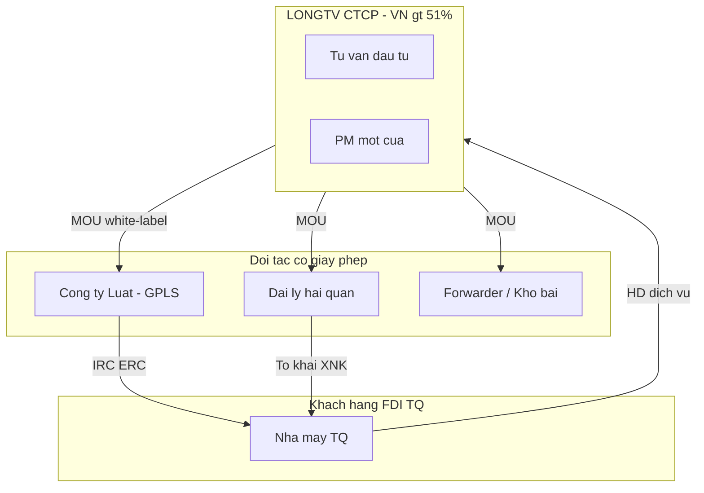

# Pháp nhân & giấy phép — Mô hình All-in-one

> **Nguyên tắc cốt tử:** LONGTV CTCP đăng ký ngành **tư vấn quản lý / tư vấn đầu tư** — **không** tự hành nghề luật sư hay khai hải quan thay đối tác nếu chưa có giấy phép chuyên ngành.
>
> All-in-one **về mặt khách hàng** = một HĐ với LONGTV; **về mặt pháp lý** = phối hợp các pháp nhân có đủ điều kiện.

---

## 1. Sơ đồ pháp nhân

---

## 2. Ba lớp dịch vụ & điều kiện pháp lý VN

### 2.1. Tư vấn đầu tư / quản lý (LONGTV trực tiếp)

| Hạng mục | Chi tiết |
|----------|----------|
| Pháp nhân | **CTCP** — vốn 2 tỷ ([QĐ #003](/docs/decisions/003-strategy-july-2026)) |
| Mã ngành VSIC | 7020 / 7490 (tư vấn quản lý) — **chọn chính xác khi nộp** |
| Giấy phép có điều kiện | **Không** (tư vấn thuần) |
| IRC cho LONGTV | Chỉ nếu cổ đông nước ngoài vượt ngưỡng FDI — xem [legal-licenses](/docs/04-research/2026-07/legal-licenses) |
| LONGTV được làm | Khảo sát, chính sách, PM hồ sơ, làm việc Sở/KCN, bán gói A1–B1 |
| LONGTV **không** được | Ký văn bản pháp lý thay luật sư; cam kết ưu đãi không verify |

### 2.2. Dịch vụ pháp lý (bắt buộc qua Công ty Luật)

| Yêu cầu | Căn cứ |
|---------|--------|
| Thành lập **Công ty Luật** hoặc hợp tác Công ty Luật có GPLS | **Luật Luật sư** |
| Luật sư có **chứng chỉ hành nghề** ký IRC, ERC, HĐ | Không outsource cho “tư vấn viên” |
| MOU white-label B2 | [mou-doi-tac-luat](/docs/03-departments/02-phap-ly/templates/mou-doi-tac-luat) |

**Mô hình LONGTV:** HĐ khách ↔ LONGTV; LONGTV ↔ Công ty Luật (phí pass-through + margin PM).

### 2.3. Dịch vụ logistics (đối tác có GP WTO)

| Loại hình | Điều kiện (tóm tắt) | LONGTV Y1 |
|-----------|---------------------|-----------|
| **Đại lý làm thủ tục hải quan** | Đăng ký kinh doanh ngành HQ; nhân sự có chứng chỉ; điều kiện theo **cam kết WTO** | MOU đại lý HQ + Oz tools |
| **Vận tải đa phương thức** | Vốn pháp định, điều kiện phương tiện | Đối tác — không tự làm Y1 |
| **Kho bãi / ICD** | GP kinh doanh kho; quy hoạch đất; PCCC | Đối tác HP — xem xét Y2 |
| **FDI vào logistics** | Lộ trình mở cửa WTO — **hạn chế** với NĐT nước ngoài một số ngành | Cổ đông TQ **không** nên góp trực tiếp vào entity logistics VN mà qua MOU |

**Rủi ro HP:** Mở công ty logistics có vốn nước ngoài cần đánh giá **điều kiện WTO + vốn tối thiểu** — desk 🟡, cần luật sư chuyên ngành.

---

## 3. Ma trận HĐ khách hàng All-in-one

| Gói | LONGTV ký | Subcontract |
|-----|-----------|-------------|
| A1 Khảo sát | ✅ | — |
| B2 Thành lập CTCP khách | ✅ (PM) | Công ty Luật |
| B1 Hải quan starter | ✅ (PM) | Đại lý HQ |
| Full Setup bundle | ✅ | Luật + HQ + (KCN intro) |
| Retainer C1 | ✅ | Luật/HQ theo phát sinh |

**Điều khoản bắt buộc trong HĐ:** LONGTV là **điều phối**; bên có GPLS chịu trách nhiệm nghề nghiệp phần việc của mình.

---

## 4. Cổ đông Trung Quốc & cấu trúc vốn

| Câu hỏi | Khuyến nghị desk |
|---------|------------------|
| TQ góp vào LONGTV CTCP? | ✅ <49%, VN >51% |
| TQ góp vào công ty logistics VN? | ⚠️ Tránh Y1 — rào WTO |
| TQ góp vốn kho/ICD? | Y3+ — cần FS riêng |
| MOU referral TQ | ✅ Qua tập đoàn cổ đông |

→ [cap-table-v1](/docs/05-clarifications/cap-table-v1)

---

## 5. Thái Nguyên — DTM & quy hoạch

| Rủi ro | Mitigation |
|--------|------------|
| DTM nước thải chặt | Checklist ngành trước A1; partner môi trường |
| Quỹ đất công nghiệp | Verify Ban QLKCN Yên Bình (KIM-012) |
| On-spot XNK | Phối hợp HQ + Sở TN |

---

## 6. Hải Phòng — Logistics & KKT

| Hạng mục | Ghi chú |
|----------|---------|
| KKT Đình Vũ–Cát Hải | Ưu đãi CIT — **field verify** |
| ICD / kho gần Lạch Huyện | Đối tác Y2; không CAPEX Y1 |
| Demurrage/detention | Dịch vụ giá trị B1 mở rộng |

---

## 7. Checklist triển khai pháp lý All-in-one

| # | Việc | Owner | Status |
|---|------|-------|--------|
| 1 | Chọn mã VSIC CTCP (tư vấn only) | Pháp lý | todo |
| 2 | MOU Công ty Luật (white-label) | Leader | KIM-050 |
| 3 | MOU đại lý HQ có GPLS | Leader | todo |
| 4 | Review HĐ Full Setup — điều khoản subcontract | Luật | KIM-020 |
| 5 | Memo WTO logistics FDI (nếu TQ muốn góp logistics) | Hermes | todo |
| 6 | Disclaimer: không cam kết 3 tháng nếu ngành đặc biệt | Sản phẩm | ✅ trong A1 SOP |

---

## Liên kết

- [all-in-one-service-complex](/docs/03-departments/01-chien-luoc/all-in-one-service-complex)
- [legal-licenses](/docs/04-research/2026-07/legal-licenses)
- [templates MOU](/docs/03-departments/02-phap-ly/templates/00-index)
