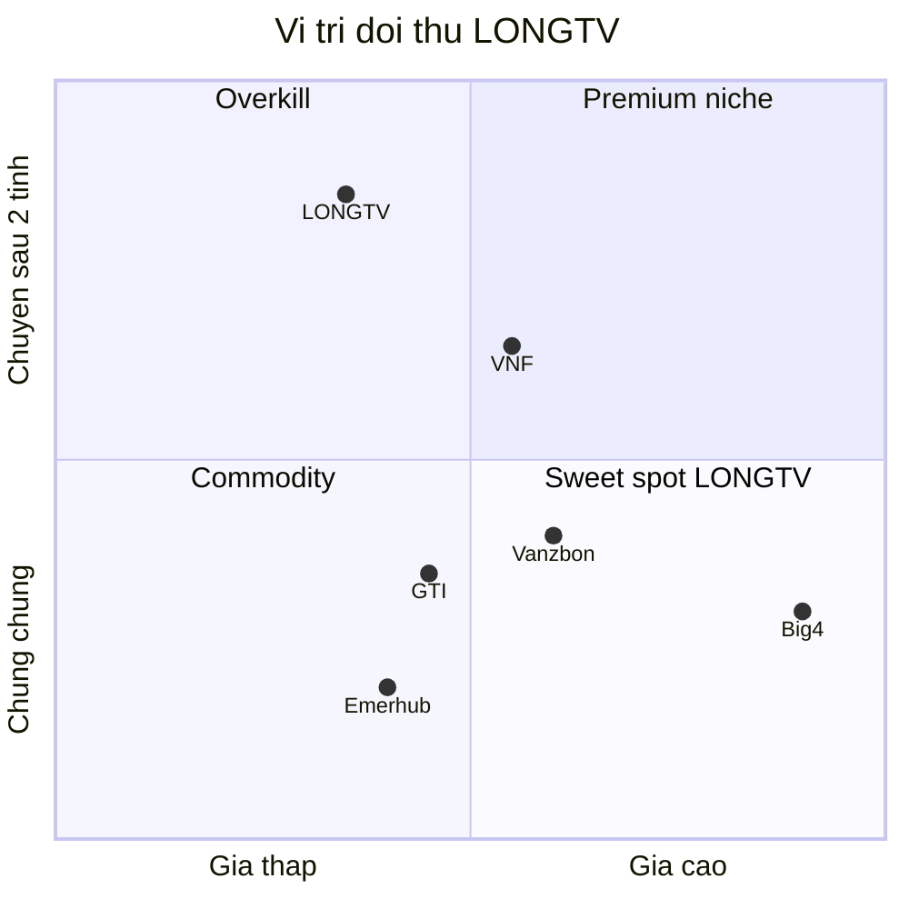

# CL-001 — Bảng đối thủ cạnh tranh

> **Khe hở LONGTV:** Chuyên sâu **TQ → 2 tỉnh** (Thái Nguyên + Hải Phòng) + công cụ **xuất nhập khẩu/customs** (hệ Oz) — đối thủ đa số làm rộng cả nước hoặc chỉ BĐS công nghiệp.

## Bảng 10 đối thủ

| # | Đối thủ | Website | Dịch vụ chính | Khách mục tiêu | Giá (ước lượng) | Điểm mạnh | Điểm yếu / khe hở |
|---|---------|---------|---------------|----------------|-----------------|-----------|-------------------|
| 1 | **VNF (Vietnam Factory)** | vnfactory.vn | BĐS CN, site selection, pháp lý, supply chain | NM TQ/FDI | Retainer + commission đất | Mạnh TQ, kinh nghiệm CNCTech | Tập trung BĐS, ít tư vấn chiến lược |
| 2 | **GTI Partner** | gtipartner.com | FDI consulting, IRC/ERC, supplier vetting | SME nước ngoài | $800–5.000+/dự án | Execution on-ground | Không chuyên 2 tỉnh |
| 3 | **Vanzbon** | vanzbon.com | Đăng ký DN, KCN Bắc Ninh/BD, logistics | NM Trung Quốc | Gói $3.500–20.000 | Mạnh manufacturing zones | Ít focus Thái Nguyên/HP |
| 4 | **FDI Vietnam Consulting** | LinkedIn | M&A, deal advisory, market entry | Quỹ, DN lớn | Cao (deal-based) | Mạng quốc tế, đa ngôn ngữ | Không phục vụ NM vừa/nhỏ |
| 5 | **VPL (Văn Phúc Law)** | vanphuclawfirm.com | Pháp lý đầu tư, đổi địa điểm dự án | NM đã vào VN | Theo giờ / dự án | Chuyên sâu pháp lý | Không làm khảo sát/GTM |
| 6 | **Emerhub** | emerhub.com | Full-service FDI, đăng ký công ty | Startup FDI | $1.500–8.000 setup | Platform + nhiều quốc gia | Template, ít local depth |
| 7 | **Cekindo / InCorp** | cekindo.com | Đăng ký công ty, kế toán, visa | Đa quốc gia | $1.200–5.000 | One-stop compliance | Không chuyên TQ→miền Bắc |
| 8 | **Viet An Law** | vietanlaw.com | Luật FDI, so sánh cấu trúc DN | NĐT nước ngoài | Luật sư theo giờ | Uy tín pháp lý | Không có GTM/site selection |
| 9 | **Sở KH&ĐT / Ban QLKCN tỉnh** | — | Giới thiệu đất, MOU đầu tư | Mọi NĐT | Miễn phí (chính quyền) | Quyền lực địa phương | Không tư vấn end-to-end, ngôn ngữ TQ |
| 10 | **Big4 (Deloitte, PwC, EY, KPMG)** | big4.vn | Restructuring, supply chain, tax | Tập đoàn lớn | $50.000+ | Brand, network global | Quá đắt cho NM TQ 50–200 CN |

## Phân nhóm cạnh tranh

## Định vị LONGTV đề xuất

| Chiều | LONGTV | Đối thủ điển hình |
|-------|--------|-------------------|
| Địa lý | **Chỉ Thái Nguyên + Hải Phòng** | Cả VN hoặc chỉ HCM/HN |
| Khách | **Chủ NM TQ 50–500 CN** | Tập đoàn hoặc chỉ BĐS |
| Ngôn ngữ | **Việt + Trung + Anh** | Thường chỉ Anh/Việt |
| Differentiator | **Customs/HS code (Oz)** | Không có |
| Gói đầu | **Khảo sát** (phương án B) | Full-service đắt |

## Hành động tiếp theo

- [ ] CL-002: Liên hệ Sở KH&ĐT Thái Nguyên — xác nhận đối tác tư vấn họ đang dùng
- [ ] KD-004: Research giá gói Khảo sát (3 đối thủ gần nhất: VNF, GTI, Vanzbon)
- [ ] Leader chốt định vị trên

## Nguồn

- [VNF](https://vnfactory.vn/en/), [GTI Partner](https://gtipartner.com/vietnam-fdi-consulting/), [Vanzbon](https://www.vanzbon.com/int/vietnam/)
- [VPL Relocation](https://vanphuclawfirm.com/en/project-relocation-services/)
