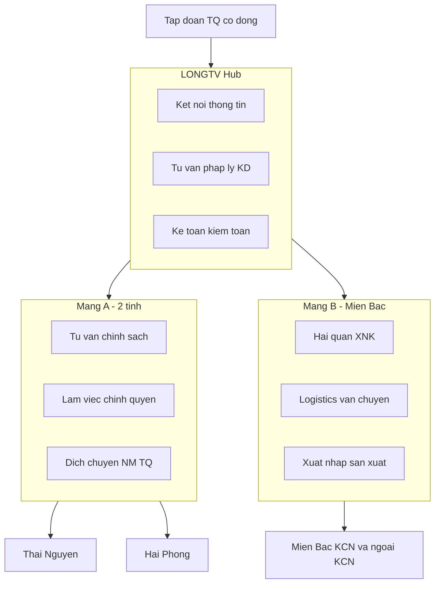

# Quyết định #003 — Chiến lược cốt lõi

**Ngày:** 2026-07-08  
**Người quyết:** Sếp Thắng (Leader)  
**Trạng thái:** ✅ Đã chốt

---

## 1. Mô hình công ty — Cổ phần + tập đoàn Trung Quốc

| Hạng mục | Quyết định |
|----------|------------|
| **Loại pháp nhân** | **Công ty cổ phần (CTCP)** |
| **Cổ đông** | Nhóm Việt Nam giữ quyền chi phối + **tập đoàn bên Trung Quốc** tham gia vốn |
| **Mục đích** | Tăng uy tín · Hỗ trợ **2 đầu** (TQ ↔ VN) · Dễ mở rộng cổ đông sau này |

**Ghi chú thực thi (PL-003):**
- Tối thiểu 3 cổ đông — cần xác định tỷ lệ vốn: TQ tập đoàn / founder VN / cổ đông chiến lược (nếu có)
- Cần MOU hoặc thỏa thuận cổ đông trước khi nộp IRC/ERC
- Hermes research PL-001 đề xuất TNHH → **Leader override** sang CTCP (có lý do chiến lược)

---

## 2. Vốn

| Hạng mục | Số tiền |
|----------|---------|
| **Vốn điều lệ tổng** | **~2 tỷ VND** |
| Nguyên tắc sở hữu | **Phía Việt Nam phải nắm trên 51%** |
| Phân bổ đề xuất (chờ chốt chi tiết) | **VN 51%+** · TQ dưới 49% · phần còn lại chia cho founder/cổ đông chiến lược |

So với research VT-001 (~1–1,5 tỷ): Leader chốt **cao hơn** — phù hợp CTCP + 2 mảng dịch vụ + văn phòng/team sớm hơn.

---

## 3. Định vị — 2 mảng + trung tâm kết nối

### Mảng A — Tư vấn chính sách & làm việc chính quyền (trọng tâm địa lý)

**Phạm vi:** **Thái Nguyên + Hải Phòng** (giữ nguyên)

| Dịch vụ | Mô tả |
|---------|-------|
| Tư vấn chính sách | Phân tích ưu đãi, ngành nghề, điều kiện đầu tư |
| Xin chính sách / incentive | Hỗ trợ hồ sơ, làm việc Sở KH&ĐT, Ban QLKCN |
| Làm việc chính quyền | Đối thoại, MOU, giới thiệu dự án FDI TQ |
| Dịch chuyển nhà máy TQ | Khảo sát → thiết lập → vận hành tại 2 tỉnh |

### Mảng B — Logistics & hải quan (tầm nhìn rộng)

**Phạm vi:** **Toàn miền Bắc** — nhà máy/xí nghiệp có nghiệp vụ **xuất · nhập · sản xuất**, trong và ngoài KCN

| Dịch vụ | Mô tả |
|---------|-------|
| Khai báo hải quan | HS code, tờ khai, thủ tục XNK (Oz tools) |
| Logistics / vận chuyển | Kết nối forwarder, TQ→VN, nội địa miền Bắc |
| Hỗ trợ sản xuất-xuất nhập | Chuỗi nguyên liệu → SX → xuất khẩu |

### Vai trò nền — Trung tâm kết nối thông tin

LONGTV không chỉ tư vấn 1 dự án — là **hub** cho nhà đầu tư nước ngoài tại VN:

| Trụ cột | Nội dung |
|---------|----------|
| **Kết nối thông tin** | Kho tri thức, cập nhật chính sách, mạng lưới đối tác |
| **Tư vấn pháp lý kinh doanh** | Đầu tư, hợp đồng, tuân thủ — phối hợp luật sư khi cần |
| **Kế toán · kiểm toán · hạch toán SX** | Phù hợp pháp luật VN — tự làm hoặc đối tác CPA |

---

## 4. Sơ đồ mô hình

---

## 5. Ảnh hưởng tới kế hoạch

| Việc | Thay đổi |
|------|----------|
| PL-003 | Timeline thành lập **CTCP** + cơ cấu cổ đông TQ |
| SP-001 | Service catalog v0.2 — 2 mảng + hub |
| VT-001 | Cập nhật vốn điều lệ 2 tỷ |
| KD-001 | Persona: NM TQ + xí nghiệp miền Bắc đã/cần SX-XNK |
| CL-005 | Memo định vị cập nhật theo quyết định này |

---

## 6. Việc tiếp theo (ưu tiên)

1. **Pháp lý:** Xác định tên tập đoàn TQ, tỷ lệ cổ phần chi tiết theo nguyên tắc **VN > 51%**, điều lệ công ty
2. **Sản phẩm:** Hoàn thiện [Service catalog v0.2](/docs/03-departments/04-san-pham/service-catalog-v0.2)
3. **Hermes:** Issue #7 ưu đãi 2 tỉnh + research cơ chế cổ đông FDI
4. **Cursor:** Cập nhật web/about + pitch framework 2 mảng
5. **Leader/team:** Điền [Trang yêu cầu làm rõ](/docs/05-clarifications/00-team-input-requirements)
