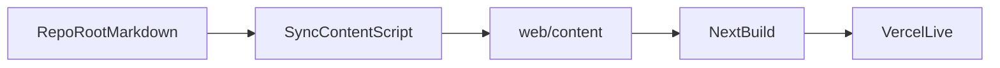

# Quyết định #004 — Pipeline content

**Ngày:** 2026-07-08  
**Người quyết:** Cursor đề xuất · Sếp Thắng duyệt nguyên tắc làm mượt  
**Trạng thái:** ✅ Áp dụng ngay

---

## Vấn đề đã gặp

Team đã có tình huống:

- file research/decision viết ở **repo root**
- nhưng web live chỉ đọc được markdown trong phạm vi `/web`
- kết quả: **đã merge nhưng live không thấy**

Điều này làm Hermes phải hỏi lại A/B, gây khựng workflow.

---

## Quy ước chính thức từ nay

### 1. Source of truth

**Tất cả tài liệu nghiệp vụ phải viết ở repo root**, ví dụ:

```text
00-about.md
00-WORKING_PRINCIPLES.md
02-monthly-roadmap/
03-departments/
04-research/
05-clarifications/
decisions/
```

### 2. Web content mirror

`/web/content/` là **bản mirror tự động**, không phải nơi author chính.

- dev/build chạy `sync-content`
- script copy markdown từ root → `web/content`
- Next.js chỉ đọc từ `web/content`

### 3. Rule cho Hermes / team

| Làm gì | Viết ở đâu |
|--------|------------|
| Research | `04-research/...` |
| Quyết định | `decisions/...` |
| Yêu cầu làm rõ | `05-clarifications/...` |
| TODO / profile phòng ban | `03-departments/...` |
| Không viết trực tiếp | `web/content/...` |

---

## Luồng chuẩn



---

## Lợi ích

1. **Hermes không cần chọn A/B nữa** — cứ viết ở root
2. **Repo sạch** — content nghiệp vụ không chui vào app layer
3. **Vercel ổn định** — chỉ ship `web/`, nhưng vẫn có full content nhờ mirror
4. **Review dễ** — mọi tài liệu business ở đúng thư mục nghiệp vụ

---

## Checklist thực thi

- [x] `web/package.json` có `predev` + `prebuild` chạy `sync-content`
- [x] `web/src/lib/docs.ts` chỉ đọc từ `web/content`
- [x] Giữ root markdown là source of truth
- [ ] Xóa dần legacy docs/content lệch chuẩn nếu còn

---

## Chốt cho team

> Nếu là tài liệu kinh doanh, nghiên cứu, quyết định, checklist: **viết ở root repo**.  
> Nếu là giao diện hoặc logic hiển thị: **sửa trong `web/src/`**.  
> Không viết tay vào `web/content/` trừ khi debug khẩn cấp.
